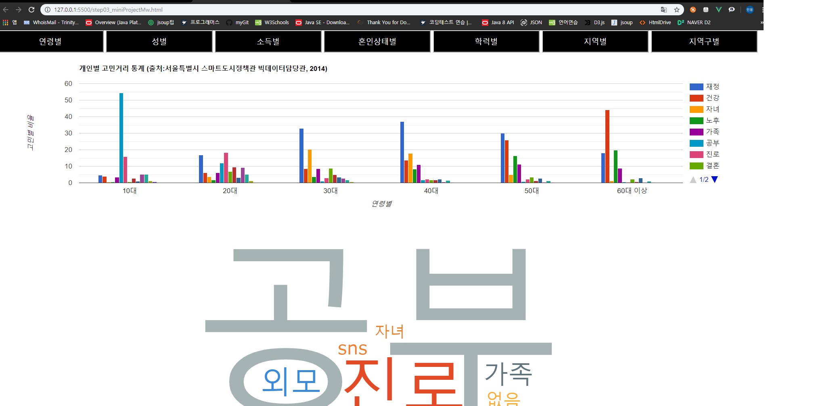
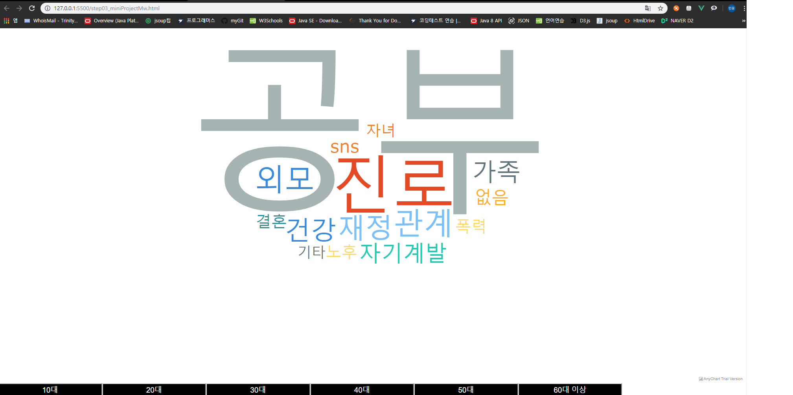

# ConcernAnalysis
서울시 열린데이터 광장 개인별 고민거리 (2011년)
[서울시 열린 데이터 광장 고민거리 통계 바로가기](https://data.seoul.go.kr/dataList/datasetView.do?infId=10416&srvType=S&serviceKind=2&currentPageNo=1&searchValue=&searchKey=null) 

서울시 경제 , 건강 , 자녀 , 노후생활 , 공부 , 진학 , 취업 , 은퇴 , 결혼 , 이성 , 우정 , 외모 , 폭력에 대한 개인적인 고민 지표 통계를 활용하여
분류별로 시각화 하여 가설 및 결론 도출

# 사용 기술셋

Java Script / Axios / Vue.js / Google Chart / Word Cloud (anychart) / JSP / JSON Data / CSS / HTML

# 개발 환경

Window 10
Eclipse Java EE IDE for Web Developers Version: Photon Release (4.8.0)  
Visual Studio Code Version: 1.38.0

# 소스가 실행 되려면?
1. Eclips에서 jsp 파일에 JSON 데이터를 넣어놓고 Web서버를 가동합니다.
2. Vsc에서 step03_miniProject.html 파일을 라이브 서버로 기동 시킵니다.
3. 분석을 시작합니다.

# 페이지 미리보기

### 분류별 데이터 차트 
</img>

### 소분류별 워드 클라우드

</img>

# 가설설정

# 결론

# 향후 추가 되었으면 하는 것은?

# 출처
### 그래프

Google / AnyChart

### 데이터

서울시 열린 데이터 광장
